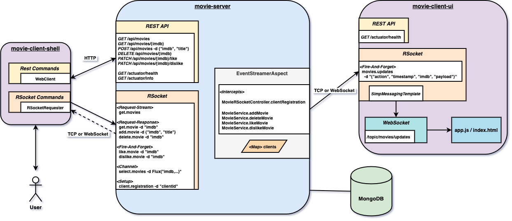

# springboot-rsocket

The goal of this project is to play with [`RSocket`](https://rsocket.io/) protocol. For it, we will implement two [`Spring Boot`](https://docs.spring.io/spring-boot/docs/current/reference/htmlsingle/) Java applications, `movie-client` and `movie-server`. As storage, we will use the reactive NoSQL database [`MongoDB`](https://www.mongodb.com/).

## Project Architecture



## Applications

- ### movie-server

  `Spring Boot` Java Web application that exposes REST API endpoints or RSocket routes to manage `movies`. `movie-server` uses `MongoDB` as storage.
  
  It has the following profiles:
  - `default`
     - start REST API on port `8080` and uses `HTTP`
     
  - `rsocket-tcp`
     - start REST API on port `8080` and uses `HTTP`
     - start RSocket on port `7000` and uses `TCP`
     
  - `rsocket-websocket`
     - start REST API on port `8080` and uses `HTTP`
     - start RSocket with mapping-path `/rsocket` and uses `WebSocket`
  
  **Routes and Endpoints**
  
  - RSocket Routes
    
    | Frame Type       | Route                             |
    | ---------------- | --------------------------------- |
    | Request-Stream   | get.movies                        |
    | Request-Response | get.movie -d "imdb"               |
    |                  | add.movie -d {"imdb", "title"}    |
    |                  | delete.movie -d "imdb"            |
    | Fire-And-Forget  | like.movie -d "imdb"              |
    |                  | dislike.movie -d "imdb"           |
    | Channel          | select.movies -d Flux("imdb,...)" |

  - REST API endpoints
    
    | Endpoint                              |
    | ------------------------------------- |
    | GET /api/movies                       |
    | GET /api/movies/{imdb}                |
    | POST /api/movies -d {"imdb", "title"} |
    | DELETE /api/movies/{imdb}             |
    | PATCH /api/movies/{imdb}/like         |
    | PATCH /api/movies/{imdb}/dislike      |

- ### movie-client

  `Spring Boot` Shell Java application that has a couple of commands to interact with `movie-server`.
  
  The picture below show those commands
  
  

  It has the following profiles:
  - `default`
     - start shell with enabled commands to call `movie-server` REST API endpoints using `HTTP`
     
  - `rsocket-tcp`
     - start shell with enabled commands to call `movie-server` REST API endpoints using `HTTP`
     - start shell with enabled commands to call `movie-server` RSocket routes using `TCP`
     
  - `rsocket-websocket`
     - start shell with enabled commands to call `movie-server` REST API endpoints using `HTTP`
     - start shell with enabled commands to call `movie-server` RSocket routes using `WebSocket`

## Prerequisites

- [`Java 11+`](https://www.oracle.com/java/technologies/javase-jdk11-downloads.html)
- [`Docker`](https://www.docker.com/)
- [`Docker-Compose`](https://docs.docker.com/compose/install/)

## Start Environment

- Open a terminal and inside `springboot-rsocket` root folder run
  ```
  docker-compose up -d
  ```

- Wait a bit until `mongodb` is Up (healthy). You can check the status by running
  ```
  docker-compose ps
  ```

## Start applications

- ### movie-server

  Open a new terminal and, inside `springboot-rsocket` root folder, run one of the following commands
  
  | Profile           | Command                                                                                           |
  | ----------------- | ------------------------------------------------------------------------------------------------- |
  | rsocket-tcp       | ./mvnw clean spring-boot:run --projects movie-server -Dspring-boot.run.profiles=rsocket-tcp       |
  | rsocket-websocket | ./mvnw clean spring-boot:run --projects movie-server -Dspring-boot.run.profiles=rsocket-websocket |
  | default           | ./mvnw clean spring-boot:run --projects movie-server                                              |
  
- ### movie-client

  Open a new terminal and, inside `springboot-rsocket` root folder, run the following command to build the executable jar file
  ```
  ./mvnw clean package -DskipTests --projects movie-client
  ```

  To start `movie-client` run one of the following commands (it should match with the one picked to run `movie-server`)
  
  | Profile           | Commands                                                                                                 |
  | ----------------- | -------------------------------------------------------------------------------------------------------- |
  | rsocket-tcp       | export SPRING_PROFILES_ACTIVE=rsocket-tcp && ./movie-client/target/movie-client-0.0.1-SNAPSHOT.jar       |
  | rsocket-websocket | export SPRING_PROFILES_ACTIVE=rsocket-websocket && ./movie-client/target/movie-client-0.0.1-SNAPSHOT.jar |
  | default           | export SPRING_PROFILES_ACTIVE=default && ./movie-client/target/movie-client-0.0.1-SNAPSHOT.jar           |
  
## Application's URL

| Application  | Type     | Transport | URL                         |
| ------------ | -------- | --------- | --------------------------- |
| movie-server | RSocket  | TCP       | tcp://localhost:7000        |
| movie-server | RSocket  | WebSocket | ws://localhost:8080/rsocket |
| movie-client | REST     | HTTP      | http://localhost:8080       |

## Playing Around

> **Note:** for running the commands below, you must start `movie-server` and `movie-client` with `rsocket-tcp` or `rsocket-websocket` profiles

- Go to `movie-client` terminal

- Add a movie using RSocket (`Request-Response`) 
  ```
  add-movie-rsocket --imdb aaa --title "RSocketland"
  ```
  
  It should return
  ```
  {"imdb":"aaa","title":"RSocketland","lastModifiedDate":"2020-07-20T12:43:39.857248","likes":0,"dislikes":0}
  ```
  
- Add a movie using REST
  ```
  add-movie-rest --imdb bbb --title "I, REST"
  ```
  
  It should return
  ```
  {"imdb":"bbb","title":"I, REST","lastModifiedDate":"2020-07-20T12:44:13.266657","likes":0,"dislikes":0}
  ```
  
- Send a like to `RSocketland` movie using RSocket (`Fire-And-Forget`)
  ```
  like-movie-rsocket --imdb aaa
  ```

  It should return
  ```
  Like submitted
  ```

- Get all movies using RSocket (`Request-Stream`)
  ```
  get-movies-rsocket
  ```
  
  It should return
  ```
  {"imdb":"aaa","title":"RSocketland","lastModifiedDate":"2020-07-20T12:56:34.565","likes":1,"dislikes":0}
  {"imdb":"bbb","title":"I, REST","lastModifiedDate":"2020-07-20T12:56:26.846","likes":0,"dislikes":0}
  ```
  
- Select movies using RSocket (`Channel`)
  ```
  select-movies-rsocket --imdbs aaa,bbb
  ```

  It should return
  ```
  | IMBD: aaa        | TITLE: RSocketland                    | LIKES: 1     | DISLIKES: 0     |
  | IMBD: bbb        | TITLE: I, REST                        | LIKES: 0     | DISLIKES: 0     |
  ```
  
- Delete movie `RSocketland` using RSocket (`Request-Response`) and `I, REST` using REST
  ```
  delete-movie-rsocket --imdb aaa
  delete-movie-rest --imdb bbb
  ```
  
## Simulation

There are two scripts that contain some commands to add movies, retrieve them, send likes and dislikes to them and, finally, delete them. One uses REST and another RSocket to communicate with `movie-server`. At the end of the script execution, it's shown the `Execution Time` in `milliseconds`.

In order to the scripts, follow the steps bellow

- Go to `movie-client` terminal

- Running the command below will start the script that uses REST
  ```
  script ../simulation-rest.txt
  ```
- Running the following command will start the script that uses RSocket
  ```
  script ../simulation-rsocket.txt
  ```

## Useful Commands

- **MongoDB**

  Find all movies
  ```
  docker exec -it mongodb mongo
  use moviedb
  db.movies.find()
  ```
  > Type `exit` to get out of `MongoDB` shell

## References

- https://docs.spring.io/spring/docs/current/spring-framework-reference/web-reactive.html#rsocket